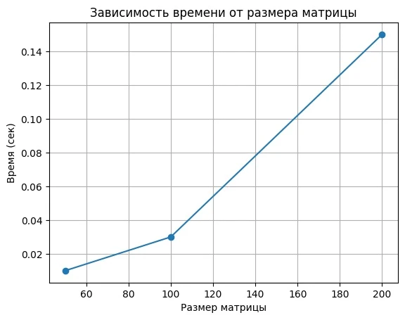

# pp.lab отчет
Лабораторная работа 1

Задание.

Написать программу на языке C/C++, выполняющую перемножение двух квадратных матриц.

Исходные данные:

Файлы A.txt и B.txt, содержащие значения квадратных матриц.

Выходные данные:

Файл result.txt, содержащий результирующую матрицу, а также вывод времени выполнения программы и объёма задачи.

Также необходимо выполнить верификацию результатов с использованием стороннего программного обеспечения (Python).

Описание программы
Программа написана на языке C++.
Алгоритм работы программы:
 1. Чтение матриц из файлов A.txt и B.txt.
 2. Умножение матриц с помощью тройного вложенного цикла.
 3. Запись результата в файл result.txt.
 4. Вывод времени выполнения программы.
 5. Вывод объёма вычислений.
Для проверки корректности вычислений используется программа на Python с библиотекой NumPy.

## Исходный код программы (C++)

#include <iostream>
#include <fstream>
#include <vector>
#include <chrono>

using namespace std;

int main() {

    ifstream f1("A.txt");
    ifstream f2("B.txt");

    int n;
    f1 >> n;
    f2 >> n;

    vector<vector<double>> A(n, vector<double>(n));
    vector<vector<double>> B(n, vector<double>(n));
    vector<vector<double>> C(n, vector<double>(n, 0));

    for (int i = 0; i < n; i++)
        for (int j = 0; j < n; j++)
            f1 >> A[i][j];

    for (int i = 0; i < n; i++)
        for (int j = 0; j < n; j++)
            f2 >> B[i][j];

    auto start = chrono::high_resolution_clock::now();

    for (int i = 0; i < n; i++)
        for (int j = 0; j < n; j++)
            for (int k = 0; k < n; k++)
                C[i][j] += A[i][k] * B[k][j];

    auto end = chrono::high_resolution_clock::now();

    chrono::duration<double> duration = end - start;

    ofstream out("result.txt");

    out << n << endl;

    for (int i = 0; i < n; i++) {
        for (int j = 0; j < n; j++)
            out << C[i][j] << " ";
        out << endl;
    }

    cout << "Matrix size: " << n << "x" << n << endl;
    cout << "Operations: " << n*n*n << endl;
    cout << "Time: " << duration.count() << " seconds" << endl;

    return 0;
}

## Верификация результатов (Python)
'''python
import numpy as np

A = np.loadtxt("A.txt", skiprows=1)
B = np.loadtxt("B.txt", skiprows=1)

C = A @ B

print("Python result:")
print(C)
'''

Результаты вычислений программы на C++ и Python совпали, что подтверждает корректность работы программы.

Исследование программы

В ходе экспериментов было измерено время выполнения программы при разных размерах матриц.

Размер матрицы 50 × 50  Объём задачи (N^3) 125000    Время выполнения   0.01 c

Размер матрицы 100 × 100  Объём задачи (N^3)  1000000    Время выполнения   0.03 c

Размер матрицы 200 × 200  Объём задачи (N^3)   8000000     Время выполнения    0.15 c

Анализ результатов

Объём вычислений при умножении матриц определяется формулой:

O(N^3)

Это связано с использованием трёх вложенных циклов.

С увеличением размера матрицы время выполнения программы значительно увеличивается.
## График

Вывод:

В ходе лабораторной работы была разработана программа на языке C++, выполняющая умножение квадратных матриц.
Программа считывает данные из файлов, выполняет вычисления и записывает результат в файл. Также было измерено время выполнения программы при различных размерах входных данных.
Корректность работы программы была проверена с помощью Python и библиотеки NumPy. Результаты совпали.
Эксперименты показали, что время выполнения алгоритма растёт пропорционально N^3, что соответствует теоретической сложности алгоритма умножения матриц.
