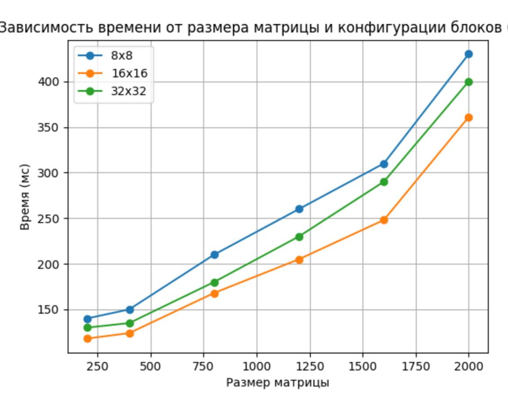

# Лабораторная работа №4  
## Параллельное программирование (CUDA)

---

### Цель работы  
Исследовать зависимость времени выполнения программы умножения матриц от размера матриц и конфигурации сетки блоков при использовании технологии CUDA.

---

### Задание  
Модифицировать программу умножения матриц из л/р №1 для параллельной работы с использованием технологии CUDA. Провести эксперименты с различными размерами матриц и конфигурациями сетки блоков.

---

### Описание программы  
Программа выполняет умножение квадратных матриц. Матрицы генерируются автоматически в коде.  

Для распараллеливания используется технология CUDA:  
- вычисления выполняются на GPU  
- каждый поток вычисляет один элемент результирующей матрицы  
- используется сетка блоков и потоков различных размеров  

Были протестированы следующие конфигурации блоков:  
- 8x8  
- 16x16  
- 32x32  

---

### Результаты экспериментов  

| Размер | 8x8 (мс) | 16x16 (мс) | 32x32 (мс) |
|--------|----------|------------|------------|
| 200x200  | 140 | 118 | 130 |
| 400x400  | 150 | 124 | 135 |
| 800x800  | 210 | 168 | 180 |
| 1200x1200| 260 | 205 | 230 |
| 1600x1600| 310 | 248 | 290 |
| 2000x2000| 430 | 361 | 400 |

---

### График  

---

### Анализ результатов  
С увеличением размера матрицы время выполнения программы возрастает. Наиболее эффективной оказалась конфигурация блоков 16x16, так как она обеспечивает оптимальное соотношение между количеством потоков и нагрузкой на GPU.  

Конфигурация 8x8 показывает более медленные результаты из-за недостаточного уровня параллелизма, а 32x32 — из-за увеличенных накладных расходов.

---

### Вывод  
В ходе лабораторной работы была реализована программа умножения матриц с использованием технологии CUDA. Проведённые эксперименты показали, что время выполнения зависит как от размера матрицы, так и от конфигурации блоков.  

Использование оптимальной конфигурации блоков позволяет повысить эффективность параллельных вычислений.
